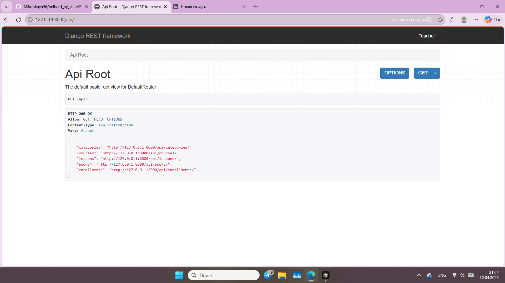
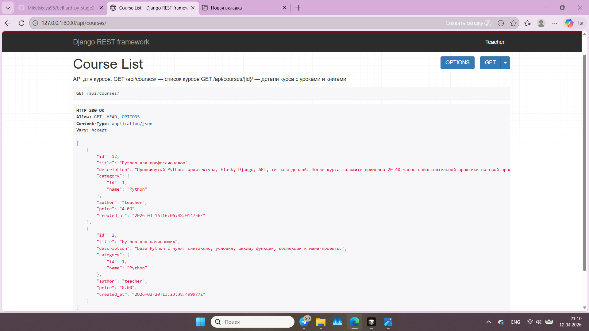
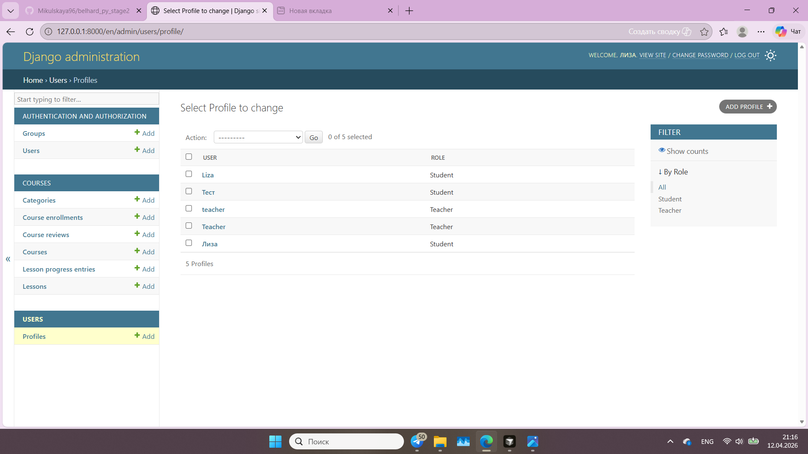

# DevLearn
A platform for learning programming (Python, courses, lessons, progress tracking).
Платформа для изучения программирования (Python, курсы, уроки, прогресс).  
Piattaforma per l’apprendimento della programmazione (Python, corsi, lezioni, progressi).

---

## English

### Dependencies (`requirements.txt`)

All packages are listed in **`requirements.txt`**. Main ones:

| Purpose | Packages |
|---------|----------|
| Framework | `Django` 5.2.x |
| Media, images | `Pillow` |
| Lesson content | `markdown`, `django-markdownx` |
| Configuration | `python-dotenv` |
| API | `djangorestframework` |
| AI on the lesson page | `groq` |
| Payments | `stripe` |
| Cloud media (optional) | `django-cloudinary-storage` |
| Production (Render, etc.) | `gunicorn`, `whitenoise`, `dj-database-url`, `psycopg2-binary` |

Install: **`pip install -r requirements.txt`** (with your virtual environment activated).

### Stack

- Python **3.12+**
- Django **5.2**
- SQLite (local) / PostgreSQL via `DATABASE_URL` (e.g. on Render)

### Quick start

1. Clone the repository and enter the project directory:
   ```bash
   git clone https://github.com/Mikulskaya96/django_project1.git
   cd django_project1
   ```

2. Virtual environment and activation:
   ```bash
   python -m venv .venv
   .venv\Scripts\activate
   ```
   Linux/macOS: `source .venv/bin/activate`

3. Install dependencies (**required**):
   ```bash
   pip install -r requirements.txt
   ```

4. Environment variables:
   ```bash
   copy .env.example .env
   ```
   (Linux/macOS: `cp .env.example .env`)  
   Edit `.env` as needed. For production, set `DJANGO_SECRET_KEY`, `DJANGO_DEBUG=False`.  
   For the AI block on lessons: **`GROQ_API_KEY`** (and optionally `GEMINI_API_KEY` — see `settings.py`).  
   For Stripe and Cloudinary, see the comments in `.env.example`.

5. Migrations and (optional) sample data:
   ```bash
   python manage.py migrate
   python manage.py populate_db
   ```

6. Superuser (access to `/admin/`):
   ```bash
   python manage.py createsuperuser
   ```

7. Run the dev server:
   ```bash
   python manage.py runserver
   ```
   Site: http://127.0.0.1:8000/ — admin: http://127.0.0.1:8000/admin/

### Live demo (screenshots)

Place image files in **`docs/screenshots/`** and commit them so they render on GitHub.

**API root** (all endpoints):



**Courses API**:



**Django Admin**:



### Tests

```bash
python manage.py test
```

Pushes to **`main`** / **`master`** trigger **GitHub Actions** (see `.github/workflows/`).

### Deploy on Render (short)

GitHub repo → service on [render.com](https://render.com), environment variables (`DJANGO_SECRET_KEY`, `DATABASE_URL`, optionally `GROQ_API_KEY`, Stripe, `CLOUDINARY_URL`, superuser for build, etc.). Details: your service settings and `render.yaml` if you use it.

### Public access & Stripe (demo)

The public production site uses **free access after sign-in** (`FREE_PUBLIC_ACCESS=True` by default). No payment is required for visitors.

To **demo Stripe Checkout locally** (portfolio): set `FREE_PUBLIC_ACCESS=False` in `.env`, add test **`STRIPE_SECRET_KEY`** and **`STRIPE_PRICE_ID`** from [Stripe Dashboard](https://dashboard.stripe.com) (Test mode), run `python manage.py runserver`, open the checkout page, and pay with test card **4242 4242 4242 4242**. See `.env.example`.

### Project layout

- `main` — home, static pages (about, contacts, legal)
- `users` — sign up, login, profiles (student / teacher roles)
- `courses` — courses, lessons, enrollments, API `/api/`
- `settings` — Django configuration

## Русский
### Зависимости (`requirements.txt`)

Все пакеты перечислены в **`requirements.txt`**. Основные:

| Назначение | Пакеты |
|------------|--------|
| Фреймворк | `Django` 5.2.x |
| Медиа, изображения | `Pillow` |
| Контент уроков | `markdown`, `django-markdownx` |
| Конфигурация | `python-dotenv` |
| API | `djangorestframework` |
| AI на уроке | `groq` |
| Оплата | `stripe` |
| Облако для медиа (опционально) | `django-cloudinary-storage` |
| Продакшен (Render и т.п.) | `gunicorn`, `whitenoise`, `dj-database-url`, `psycopg2-binary` |

Установка: **`pip install -r requirements.txt`** (из активированного виртуального окружения).

### Стек

- Python **3.12+**
- Django **5.2**
- SQLite (локально) / PostgreSQL через `DATABASE_URL` (например, Render)

### Быстрый старт

1. Клонировать репозиторий и перейти в каталог:
   ```bash
   git clone https://github.com/Mikulskaya96/django_project1.git
   cd django_project1
   ```

2. Виртуальное окружение и активация:
   ```bash
   python -m venv .venv
   .venv\Scripts\activate
   ```
   Linux/macOS: `source .venv/bin/activate`

3. Установить зависимости (**обязательно**):
   ```bash
   pip install -r requirements.txt
   ```

4. Переменные окружения:
   ```bash
   copy .env.example .env
   ```
   (Linux/macOS: `cp .env.example .env`)  
   При необходимости отредактируйте `.env`. Для продакшена задайте `DJANGO_SECRET_KEY`, `DJANGO_DEBUG=False`.  
   Для AI-блока на уроке: **`GROQ_API_KEY`** (и при необходимости `GEMINI_API_KEY` — см. `settings.py`).  
   Для Stripe, Cloudinary — см. комментарии в `.env.example`.

5. Миграции и (по желанию) данные:
   ```bash
   python manage.py migrate
   python manage.py populate_db
   ```

6. Суперпользователь (доступ в `/admin/`):
   ```bash
   python manage.py createsuperuser
   ```

7. Запуск:
   ```bash
   python manage.py runserver
   ```
   Сайт: http://127.0.0.1:8000/ — админка: http://127.0.0.1:8000/admin/

### Демо (скриншоты)

Положите файлы в **`docs/screenshots/`** и закоммитьте — тогда картинки отобразятся на GitHub.

**API root** (все endpoints):


**Courses API**:


**Django Admin**:


### Тесты

```bash
python manage.py test
```

При push в ветки `main` / `master` в репозитории настроен **GitHub Actions** (см. `.github/workflows/`).

### Деплой на Render (кратко)

Репозиторий на GitHub → сервис на [render.com](https://render.com), переменные окружения (`DJANGO_SECRET_KEY`, `DATABASE_URL`, при необходимости `GROQ_API_KEY`, Stripe, `CLOUDINARY_URL`, суперпользователь для сборки и т.д.). Подробности — в настройках вашего сервиса и в `render.yaml`, если используется.

### Публичный доступ и демо Stripe

**Публичный деплой** — бесплатный доступ к урокам после входа (`FREE_PUBLIC_ACCESS=True` по умолчанию); оплата на сайте не требуется.

**Демо оплаты Stripe локально** (для портфолио): в `.env` задайте `FREE_PUBLIC_ACCESS=False`, тестовые `STRIPE_SECRET_KEY` и `STRIPE_PRICE_ID` из [Stripe Dashboard](https://dashboard.stripe.com) (режим Test), запустите `python manage.py runserver`, откройте оплату, карта **4242 4242 4242 4242**. Подробности — в `.env.example`.

### Структура проекта

- `main` — главная, статические страницы (о нас, контакты, оферта)
- `users` — регистрация, вход, профили (роли студент / преподаватель)
- `courses` — курсы, уроки, записи, API `/api/`
- `settings` — конфигурация Django

---

## Italiano

### Dipendenze (`requirements.txt`)

Tutti i pacchetti sono elencati in **`requirements.txt`**. Esempi:

| Uso | Pacchetti |
|-----|-----------|
| Framework | `Django` 5.2.x |
| Immagini | `Pillow` |
| Contenuti lezioni | `markdown`, `django-markdownx` |
| Configurazione | `python-dotenv` |
| API REST | `djangorestframework` |
| Assistente AI sulla lezione | `groq` |
| Pagamenti | `stripe` |
| Media cloud (opzionale) | `django-cloudinary-storage` |
| Produzione (Render ecc.) | `gunicorn`, `whitenoise`, `dj-database-url`, `psycopg2-binary` |

Installazione: **`pip install -r requirements.txt`** (con ambiente virtuale attivo).

### Stack

- Python **3.12+**
- Django **5.2**
- SQLite (locale) / PostgreSQL tramite `DATABASE_URL` (es. su Render)

### Avvio rapido

1. Clona il repository e entra nella cartella:
   ```bash
   git clone https://github.com/Mikulskaya96/django_project1.git
   cd django_project1
   ```

2. Ambiente virtuale:
   ```bash
   python -m venv .venv
   .venv\Scripts\activate
   ```
   Linux/macOS: `source .venv/bin/activate`

3. Installa le dipendenze (**obbligatorio**):
   ```bash
   pip install -r requirements.txt
   ```

4. Variabili d’ambiente:
   ```bash
   copy .env.example .env
   ```
   (Linux/macOS: `cp .env.example .env`)  
   Modifica `.env` se serve. In produzione: `DJANGO_SECRET_KEY`, `DJANGO_DEBUG=False`.  
   Per l’AI sulla lezione: **`GROQ_API_KEY`**. Stripe e Cloudinary: vedi `.env.example`.

5. Migrazioni e (opzionale) dati di esempio:
   ```bash
   python manage.py migrate
   python manage.py populate_db
   ```

6. Superuser (admin `/admin/`):
   ```bash
   python manage.py createsuperuser
   ```

7. Avvio server di sviluppo:
   ```bash
   python manage.py runserver
   ```
   Sito: http://127.0.0.1:8000/ — admin: http://127.0.0.1:8000/admin/

### Demo (screenshots)

Metti i file in **`docs/screenshots/`** e committali così GitHub mostra le immagini.

**API root** (tutti gli endpoint):


**Courses API**:


**Django Admin**:


### Test

```bash
python manage.py test
```

### Accesso pubblico e demo Stripe

Il deploy pubblico offre **accesso gratuito dopo il login** (`FREE_PUBLIC_ACCESS=True` di default). Per **testare Stripe in locale**: `FREE_PUBLIC_ACCESS=False` nel `.env`, chiavi test da Stripe (modalità Test), `python manage.py runserver`, carta **4242 4242 4242 4242**. Vedi `.env.example`.

### Licenza / License

MIT (o indicare la propria).
