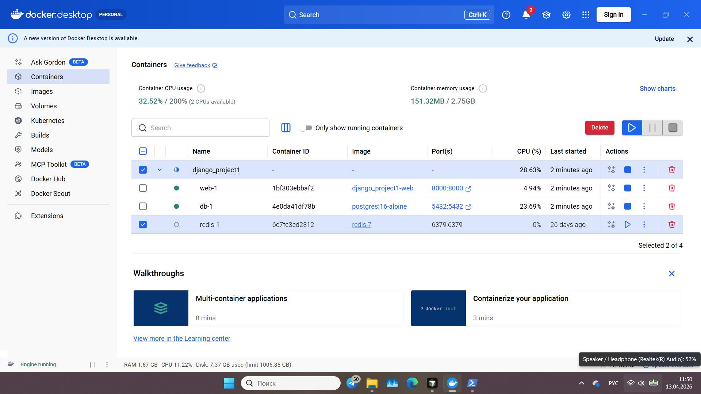
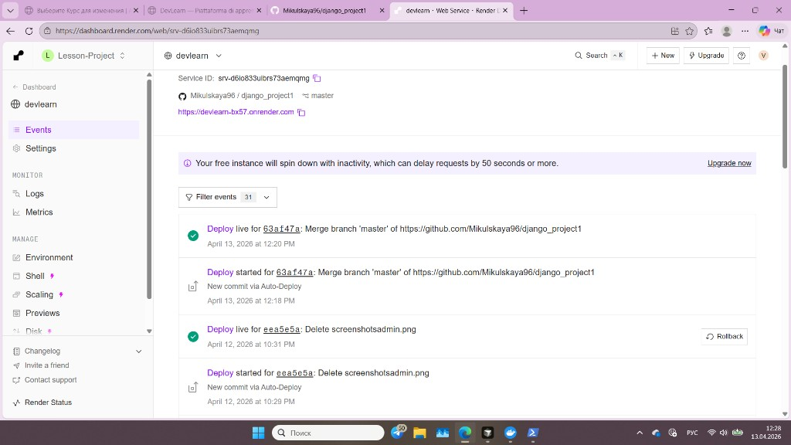

# DevLearn
A platform for learning programming (Python, courses, lessons, progress tracking).
Платформа для изучения программирования (Python, курсы, уроки, прогресс).  
Piattaforma per l’apprendimento della programmazione (Python, corsi, lezioni, progressi).

**Live site (production):** https://devlearn-bx57.onrender.com

---

## English

### Dependencies (`requirements.txt`)

All packages are listed in **`requirements.txt`**. Main ones:

| Purpose | Packages |
|---------|----------|
| Framework | `Django` 5.2.x |
| Media, images | `Pillow` |
| Lesson content | `markdown`, `django-markdownx` |
| Configuration | `python-dotenv` |
| API | `djangorestframework` |
| AI on the lesson page | `groq` |
| Payments | `stripe` |
| Cloud media (optional) | `django-cloudinary-storage` |
| Production (Render, etc.) | `gunicorn`, `whitenoise`, `dj-database-url`, `psycopg2-binary` |

Install: **`pip install -r requirements.txt`** (inside an activated virtual environment).

### Stack

- Python **3.12+**
- Django **5.2**
- SQLite (local) / PostgreSQL via `DATABASE_URL` (e.g. on Render)

### Quick start

1. Clone the repository and enter the project directory:
   ```bash
   git clone https://github.com/Mikulskaya96/django_project1.git
   cd django_project1
   ```

2. Virtual environment and activation:
   ```bash
   python -m venv .venv
   .venv\Scripts\activate
   ```
   Linux/macOS: `source .venv/bin/activate`

3. Install dependencies (**required**):
   ```bash
   pip install -r requirements.txt
   ```

4. Environment variables:
   ```bash
   copy .env.example .env
   ```
   (Linux/macOS: `cp .env.example .env`)  
   Adjust `.env` for local vs production use (e.g. `DJANGO_SECRET_KEY`, `DJANGO_DEBUG=False` on production).  
   For the AI block on lessons: **`GROQ_API_KEY`** (and optionally `GEMINI_API_KEY` — see `settings.py`).  
   For Stripe and Cloudinary, see the comments in `.env.example`.

5. Migrations and (optional) sample data:
   ```bash
   python manage.py migrate
   python manage.py populate_db
   ```

6. Superuser (access to `/admin/`):
   ```bash
   python manage.py createsuperuser
   ```

7. Run the dev server:
   ```bash
   python manage.py runserver
   ```
   Site: http://127.0.0.1:8000/ — admin: http://127.0.0.1:8000/admin/

**URLs / i18n:** Russian is the default language. http://127.0.0.1:8000/ may redirect to http://127.0.0.1:8000/ru/ . Switch to EN or IT via the site language selector.

**`.env` (first run):** Copy `.env.example` to `.env`. Minimum fields: `DJANGO_DEBUG=True` for local runs and a unique `DJANGO_SECRET_KEY` (generation command documented in `.env.example`). `GROQ_API_KEY`, `GEMINI_API_KEY`, Stripe variables, Cloudinary, and `GA4_MEASUREMENT_ID` are optional until those features are enabled.

### Live demo (screenshots)

Screenshots live in **`docs/screenshots/`** — add those files to the repository so Markdown images load on GitHub.

They may include browser chrome (tabs, toolbar) or the OS taskbar: they reflect the actual local or dashboard setup at capture time, not retouched marketing assets.

**API root** (all endpoints):


**Courses API**:


**Django Admin**:


### Tests

```bash
python manage.py test
```

### Docker (local dev)

Production on **Render** uses `render.yaml` (install, `migrate`, **gunicorn**) — not necessarily this image. **Docker Compose targets local development**: same overall stack as cloud (PostgreSQL via `DATABASE_URL`), without SQLite inside the app when `DATABASE_URL` is set.

1. [Docker Desktop](https://www.docker.com/products/docker-desktop/) (or Docker Engine + Compose plugin) installed.
2. From the project root:

```bash
docker compose up --build
```

3. First time (new DB volume), in another terminal:

```bash
docker compose exec web python manage.py migrate
docker compose exec web python manage.py populate_db
```

4. Open http://127.0.0.1:8000/

**Docker Desktop** (running stack: `web` + `db`):



The `web` service bind-mounts the project directory (`.:/app`), so code changes apply without rebuilding. Postgres data persists in the Docker volume `devlearn_db_data`. **`redis` is not included** — the app does not use Redis (ignore a `redis` container if an old screenshot shows one).

Pushes to **`main`** / **`master`** trigger **GitHub Actions** (see `.github/workflows/`).

### Deploy on Render (short)

**Production URL:** https://devlearn-bx57.onrender.com

Deploy from the GitHub repository to [render.com](https://render.com): set environment variables (`DJANGO_SECRET_KEY`, `DATABASE_URL`, optionally `GROQ_API_KEY`, Stripe, `CLOUDINARY_URL`, superuser for build, etc.). Full checklist: Render dashboard + `render.yaml` when Blueprint deploy is enabled.

**Screenshot** (optional), file **`docs/screenshots/render_dashboard.png`**: e.g. **web service** **Live**, last deploy **succeeded**. **Do not expose secrets** — omit or blur the **Environment** tab (keys/values).



### Public access & Stripe (demo)

The public production site uses **free access after sign-in** (`FREE_PUBLIC_ACCESS=True` by default). No payment is required for visitors.

To **try Stripe Checkout locally**: set `FREE_PUBLIC_ACCESS=False` in `.env`, add test **`STRIPE_SECRET_KEY`** and **`STRIPE_PRICE_ID`** from [Stripe Dashboard](https://dashboard.stripe.com) (Test mode), run `python manage.py runserver`, open the checkout page, and use test card **4242 4242 4242 4242**. See `.env.example`.

### Project layout

- `main` — home, static pages (about, contacts, legal)
- `users` — sign up, login, profiles (student / teacher roles)
- `courses` — courses, lessons, enrollments, API `/api/`
- `settings` — Django configuration
- `LICENSE` — MIT (see file in repo root)

## Русский

**Сайт (прод):** https://devlearn-bx57.onrender.com

### Зависимости (`requirements.txt`)

Все пакеты перечислены в **`requirements.txt`**. Основные:

| Назначение | Пакеты |
|------------|--------|
| Фреймворк | `Django` 5.2.x |
| Медиа, изображения | `Pillow` |
| Контент уроков | `markdown`, `django-markdownx` |
| Конфигурация | `python-dotenv` |
| API | `djangorestframework` |
| AI на уроке | `groq` |
| Оплата | `stripe` |
| Облако для медиа (опционально) | `django-cloudinary-storage` |
| Продакшен (Render и т.п.) | `gunicorn`, `whitenoise`, `dj-database-url`, `psycopg2-binary` |

Установка: **`pip install -r requirements.txt`** (из активированного виртуального окружения).

### Стек

- Python **3.12+**
- Django **5.2**
- SQLite (локально) / PostgreSQL через `DATABASE_URL` (например, Render)

### Быстрый старт

1. Клонировать репозиторий и перейти в каталог:
   ```bash
   git clone https://github.com/Mikulskaya96/django_project1.git
   cd django_project1
   ```

2. Виртуальное окружение и активация:
   ```bash
   python -m venv .venv
   .venv\Scripts\activate
   ```
   Linux/macOS: `source .venv/bin/activate`

3. Установить зависимости (**обязательно**):
   ```bash
   pip install -r requirements.txt
   ```

4. Переменные окружения:
   ```bash
   copy .env.example .env
   ```
   (Linux/macOS: `cp .env.example .env`)  
   Редактирование `.env` — по необходимости. Для продакшена: `DJANGO_SECRET_KEY`, `DJANGO_DEBUG=False`.  
   Для AI-блока на уроке: **`GROQ_API_KEY`** (и при необходимости `GEMINI_API_KEY` — см. `settings.py`).  
   Для Stripe, Cloudinary — см. комментарии в `.env.example`.

5. Миграции и (по желанию) данные:
   ```bash
   python manage.py migrate
   python manage.py populate_db
   ```

6. Суперпользователь (доступ в `/admin/`):
   ```bash
   python manage.py createsuperuser
   ```

7. Запуск:
   ```bash
   python manage.py runserver
   ```
   Сайт: http://127.0.0.1:8000/ — админка: http://127.0.0.1:8000/admin/

**URL и языки:** язык по умолчанию — русский. При открытии http://127.0.0.1:8000/ возможен редирект на http://127.0.0.1:8000/ru/ . Переключение EN/IT — через селектор языка в интерфейсе.

**`.env` (первый запуск):** скопировать `.env.example` в `.env`. Минимум: `DJANGO_DEBUG=True` для локальной работы и уникальный `DJANGO_SECRET_KEY` (генерация — в `.env.example`). `GROQ_API_KEY`, `GEMINI_API_KEY`, переменные Stripe, Cloudinary и `GA4_MEASUREMENT_ID` не обязательны, пока не используются соответствующие возможности.

### Демо (скриншоты)

Скриншоты — в **`docs/screenshots/`**; файлы должны быть закоммичены, иначе картинки в Markdown на GitHub не загрузятся.

На них могут быть элементы браузера и интерфейса ОС — зафиксировано реальное окружение во время съёмки, без отдельной постобработки под «витринный» вид.

**API root** (все endpoints):


**Courses API**:


**Django Admin**:


### Docker (локально)

Продакшен на **Render** использует `render.yaml` (не обязательно этот образ). Локально: **Docker Compose** (`docker compose up --build`), PostgreSQL + приложение в контейнерах. Подробности — в английском разделе **Docker (local dev)** выше.

**Docker Desktop** (запущенный стек `web` + `db`):


### Тесты

```bash
python manage.py test
```

При push в ветки `main` / `master` в репозитории настроен **GitHub Actions** (см. `.github/workflows/`).

### Деплой на Render (кратко)

**Продакшен:** https://devlearn-bx57.onrender.com

Деплой с GitHub на [render.com](https://render.com): переменные окружения (`DJANGO_SECRET_KEY`, `DATABASE_URL`, при необходимости `GROQ_API_KEY`, Stripe, `CLOUDINARY_URL`, суперпользователь для сборки и т.д.). Полный список — в панели Render и в `render.yaml` при деплое по Blueprint.

**Скриншот** (по желанию), файл **`docs/screenshots/render_dashboard.png`**: статус сервиса **Live**, последний деплой **успешен**. **Секреты не показывать** — не включать в кадр вкладку **Environment** (ключи и значения) или размыть эту область.


### Публичный доступ и демо Stripe

**Публичный деплой** — бесплатный доступ к урокам после входа (`FREE_PUBLIC_ACCESS=True` по умолчанию); оплата на сайте не требуется.

**Демо оплаты Stripe локально**: в `.env` — `FREE_PUBLIC_ACCESS=False`, тестовые `STRIPE_SECRET_KEY` и `STRIPE_PRICE_ID` из [Stripe Dashboard](https://dashboard.stripe.com) (режим Test), затем `python manage.py runserver`, страница оплаты, тестовая карта **4242 4242 4242 4242**. Подробнее — `.env.example`.

### Структура проекта

- `main` — главная, статические страницы (о нас, контакты, оферта)
- `users` — регистрация, вход, профили (роли студент / преподаватель)
- `courses` — курсы, уроки, записи, API `/api/`
- `settings` — конфигурация Django
- `LICENSE` — MIT (файл в корне репозитория)

---

## Italiano

**Sito in produzione:** https://devlearn-bx57.onrender.com

### Dipendenze (`requirements.txt`)

Tutti i pacchetti sono elencati in **`requirements.txt`**. Esempi:

| Uso | Pacchetti |
|-----|-----------|
| Framework | `Django` 5.2.x |
| Immagini | `Pillow` |
| Contenuti lezioni | `markdown`, `django-markdownx` |
| Configurazione | `python-dotenv` |
| API REST | `djangorestframework` |
| Assistente AI sulla lezione | `groq` |
| Pagamenti | `stripe` |
| Media cloud (opzionale) | `django-cloudinary-storage` |
| Produzione (Render ecc.) | `gunicorn`, `whitenoise`, `dj-database-url`, `psycopg2-binary` |

Installazione: **`pip install -r requirements.txt`** (ambiente virtuale attivo).

### Stack

- Python **3.12+**
- Django **5.2**
- SQLite (locale) / PostgreSQL tramite `DATABASE_URL` (es. su Render)

### Avvio rapido

1. Clona il repository e entra nella cartella:
   ```bash
   git clone https://github.com/Mikulskaya96/django_project1.git
   cd django_project1
   ```

2. Ambiente virtuale:
   ```bash
   python -m venv .venv
   .venv\Scripts\activate
   ```
   Linux/macOS: `source .venv/bin/activate`

3. Installa le dipendenze (**obbligatorio**):
   ```bash
   pip install -r requirements.txt
   ```

4. Variabili d’ambiente:
   ```bash
   copy .env.example .env
   ```
   (Linux/macOS: `cp .env.example .env`)  
   Modifica `.env` se serve. In produzione: `DJANGO_SECRET_KEY`, `DJANGO_DEBUG=False`.  
   Per l’AI sulla lezione: **`GROQ_API_KEY`**. Stripe e Cloudinary: vedi `.env.example`.

5. Migrazioni e (opzionale) dati di esempio:
   ```bash
   python manage.py migrate
   python manage.py populate_db
   ```

6. Superuser (admin `/admin/`):
   ```bash
   python manage.py createsuperuser
   ```

7. Avvio server di sviluppo:
   ```bash
   python manage.py runserver
   ```
   Sito: http://127.0.0.1:8000/ — admin: http://127.0.0.1:8000/admin/

**URL / i18n:** lingua predefinita: russo. Su http://127.0.0.1:8000/ si può essere reindirizzati a http://127.0.0.1:8000/ru/ . EN/IT tramite il selettore lingua nel sito.

**`.env` (primo avvio):** copiare `.env.example` in `.env`. Valori minimi: `DJANGO_DEBUG=True` in locale e un `DJANGO_SECRET_KEY` dedicato (generazione nel commento di `.env.example`). `GROQ_API_KEY`, `GEMINI_API_KEY`, variabili Stripe, Cloudinary e `GA4_MEASUREMENT_ID` sono facoltativi finché quelle integrazioni non servono.

### Demo (screenshots)

Gli screenshot sono in **`docs/screenshots/`** — vanno inclusi nel repository affinché le immagini Markdown si caricino su GitHub.

Possono includere barre del browser o della finestra e elementi del sistema operativo: illustrano l’ambiente locale o la dashboard nel momento della cattura, senza ritocco «promozionale».

**API root** (tutti gli endpoint):


**Courses API**:


**Django Admin**:


### Docker (sviluppo locale)

In produzione **Render** usa `render.yaml`. In locale: **Docker Compose** (`docker compose up --build`), PostgreSQL + app. Dettagli nella sezione inglese **Docker (local dev)**.

**Docker Desktop** (stack `web` + `db` in esecuzione):


### Test

```bash
python manage.py test
```

Push su **`main`** / **`master`** attivano **GitHub Actions** (vedi `.github/workflows/`).

### Deploy su Render (breve)

**Produzione:** https://devlearn-bx57.onrender.com

Deploy da repo GitHub a [render.com](https://render.com): variabili d’ambiente (`DJANGO_SECRET_KEY`, `DATABASE_URL`, ecc.). Dettaglio: dashboard Render + `render.yaml` se si usa Blueprint.

**Screenshot** (opzionale), file **`docs/screenshots/render_dashboard.png`**: servizio **Live**, ultimo deploy **riuscito**. **Non esporre segreti** — escludere o sfocare la scheda **Environment** (chiavi/valori).


### Accesso pubblico e demo Stripe

Il deploy pubblico offre **accesso gratuito dopo il login** (`FREE_PUBLIC_ACCESS=True` di default). Per **testare Stripe in locale**: `FREE_PUBLIC_ACCESS=False` nel `.env`, chiavi test da Stripe (modalità Test), `python manage.py runserver`, carta **4242 4242 4242 4242**. Vedi `.env.example`.

### Struttura del progetto

- `main` — home, pagine statiche (about, contatti, legal)
- `users` — registrazione, login, profili (studente / insegnante)
- `courses` — corsi, lezioni, iscrizioni, API `/api/`
- `settings` — configurazione Django
- `LICENSE` — MIT (file nella root)

### Licenza / License

**MIT** — vedi il file **`LICENSE`** nella root del repository.
